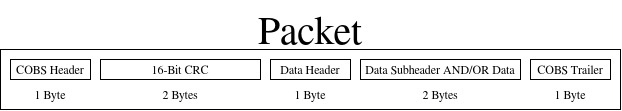
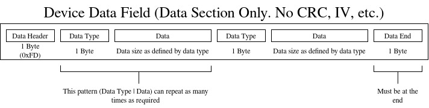

# TCP Communication Protocol Specifications

## Where is this protocol used?

This protocol is used for all TCP communication between MeT IOT devices and external devices (standalone library, Home Assistant, etc.)

## Connection Initialization Sequence

The following protocol outlines the process MeT IOT devices take when starting a connection with this library.

0. Zeroconf packet sent out for device discovery.
1. Library connects to devices TCP socket.
2. Library initiates ECDH handshake (*see `ECDH Handshake` for more details*).
3. Library sends a identification request command.
4. Device responds with its device type and unique identifier.
5. Regular use begins.

## ECDH Handshake

**TODO**

## Encryption

This protocol uses AES-256-CBC. Each message but be encrypted with a new unique 16 byte IV that is transported with the message (*see `Protocol Format`*)

## CRC

**TODO**

G.D. Nguyen, “Fast CRCs,” IEEE Transactions on Computers, vol. 58, no. 10, pp. 1321-1331, Oct. 2009

## Protocol Format

### Packet Format

| Field | Description | Bytes |
|-|-|-|
| COBS Header | Used to identify the start of a packet. Stores information on how data after it is to be decoded | 1 |
| Encrypted Data | Data encrypted with AES-256. See `Encrypted Block Format` below. | A multiple of 16 bytes (16, 32, 48, 64, etc.) |
| IV | The IV used during encryption. Ensures each encrypted message is unique even if data is identical. | 16 |
| COBS Trailer | Used to identify the end of a packet. This is always 0x00 | 1 | 

### Encrypted Block Format

| Field | Description | Bytes |
|-|-|-|
| CRC | 16 bit Cyclic Redundancy Check. Used for error detection in the data | 2 |
| Data Header | Identifies packet purpose | 1 |
| Data | Payload as defined below (dependent on direction & Data Header) | 0-n |

### ESP32 to Library Protocol

| Purpose | Header | Data | Bytes |
|-|-|-|-|
| Malformed Packet Notification | 0xFF | | 1 |
| Device Identifier | 0xFE | 1 byte device identifier (*see `Device Identification Codes`*) followed by a 4 byte unique device identifier | 5 |
| Data | 0xFD | Refer to `Device Data Field` |  |

### Library to ESP32 Protocol

| Purpose | Header | Data | Bytes |
|-|-|-|-|
| Malformed Packet Notification | 0xFF | | 1 |
| Device Identification Request | 0xFE | | 1 |

### Device Identification Codes

| Code (1 Byte) | Device |
|-|-|
| 0xFF | Fish Tank |

### Device Data Field

*As stated in the diagram, this only represents the **Data Header and Data Subheader/Data** sections of the packet format (See `Packet Diagram` above)*

#### Device Data Field Format

| Field | Purpose |
|-|-|
| Data sub-header (*see `Device Data Field Sub-Headers`*) | Identify the data proceeding |
| Data | Data received. To be interpreted using information gathered from the Sub-Header |

> The above pattern repeats for all information the device wishes to transfer: Sub-Header, Data, Sub-Header, Data, ...

#### Device Data Field Sub-Headers

| Sub-Header | Data Field | Data Type |
|-|-|-|
| 0x00 | Data End | |

> [!IMPORTANT]
> Only the following data types are supported:
>
> * `int8_t`
> * `char`
> * `int16_t`
> * `int32_t`
> * `float`
> * `double`
> * `size_t`